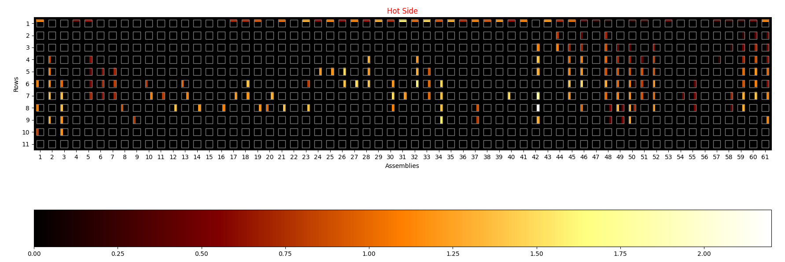

# Visualization Term Project: Visualization of Tube-Thinning Data #


# How To Run #

All instructions are to be performed in the project root directory. It could potentially
work in a Windows environment, though I have only tried it on Ubuntu 18.04.

## Install Python 3 ##
```bash
sudo apt update
sudo apt install python3 python3-pip
```

## Installing Dependencies ##
### Virtual Environment ###
**To install pipenv:**
```bash
pip3 install --user pipenv
```

After installing pipenv, navigate to your project root and do the following to set it up:
```bash
pipenv install
pipenv shell
```

## Running ##
First, make `project.py` executable (if it isn't already).
```bash
chmod +x tube_vis.py
```

Now run in the `pipenv`:
```bash
pipenv run "./tube_vis.py /path/to/excel/file.xlsx" "name_of_sheet" 2020 "label in database" 5.6 27 34
```

Command-line options:
```bash
usage: tube_vis.py [-h]
                   file sheet year label ideal_value num_assemblies num_rows

positional arguments:
  file            The Excel file to open
  sheet           The sheet in the Excel file that contains a DB-style record
  year            The year the data was taken
  label           The label of the data
  ideal_value     The ideal value for the data
  num_assemblies  The number of assemblies.
  num_rows        The number of rows in each assembly

optional arguments:
  -h, --help      show this help message and exit

```
